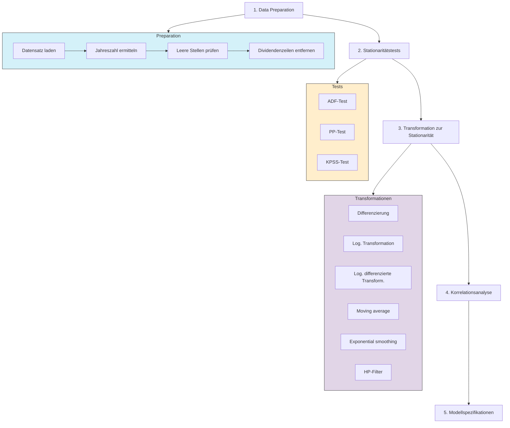

# Zeitreihenanalyse-Projekt

## Überblick
Dieses Repository enthält die Ergebnisse und den Code unserer Zeitreihenanalyse im Rahmen des Schwerpunkts Business Analytics (BBA) bei Herrn Menden.

## Team
- Fabian Niebelschütz
- Andrew Barnhoorn
- Kai Hufnagel

## Projektbeschreibung
In diesem Projekt führen wir eine umfassende Zeitreihenanalyse durch, um [kurze Beschreibung des Ziels, z.B. "Muster und Trends in wirtschaftlichen Daten zu identifizieren und Prognosemodelle zu entwickeln"]. Die Analyse umfasst verschiedene statistische Methoden und Visualisierungstechniken, angewendet auf drei unterschiedliche Zeitreihen:

1. **Zeitreihe 1**:
2. **Zeitreihe 2**:
3. **Zeitreihe 3**:

## Inhalte
- `data/`: Enthält die für die Analyse verwendeten Datensätze
  - `zeitreihe1/`: Daten für die erste Zeitreihe
  - `zeitreihe2/`: Daten für die zweite Zeitreihe
  - `zeitreihe3/`: Daten für die dritte Zeitreihe
- `notebooks/`: Jupyter Notebooks mit der durchgeführten Analyse
  - `02_zeitreihe1_analysis.ipynb`: Detailanalyse der ersten Zeitreihe
  - `03_zeitreihe2_analysis.ipynb`: Detailanalyse der zweiten Zeitreihe
  - `04_zeitreihe3_analysis.ipynb`: Detailanalyse der dritten Zeitreihe
- `results/`: Visualisierungen und Ergebnisse der Analyse
- `docs/`: Weiterführende Dokumentation

## Zeitplan
- **05.05.2025**: Responsitory erstellen & Präsentieren
- **12.05.2025**: Data Preperation & Analyse der Zeitreihen
- **19.05.2025**: Analysen Visualisieren & Ergebnisse Präsentieren
- **Abgabe**: [19.05.2025]

## Prozess darstellung unserer Modell erstellung

## Zeitreihenanalyse-Prozess

