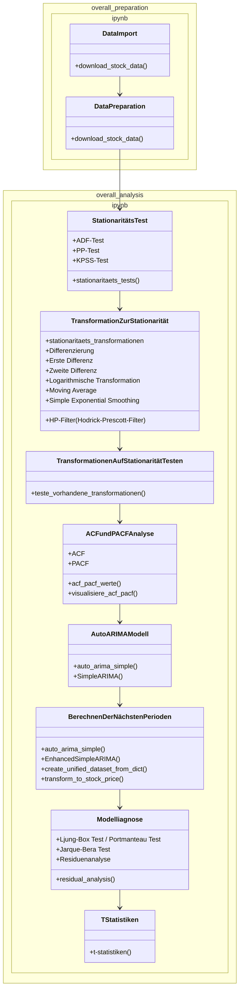

```mermaid
classDiagram

    namespace overall_preparation.ipynb {
        class DataImport {
            +download_stock_data()
        }
        
        class DataPreparation {
            +download_stock_data()
        }
    }
    
    namespace overall_analysis.ipynb {
        class StationaritätsTest {
            +stationaritaets_tests()
            +ADF-Test
            +PP-Test
            +KPSS-Test
        }
        
        class TransformationZurStationarität {
            +stationaritaets_transformationen
            +Differenzierung
            +Erste Differenz
            +Zweite Differenz
            +Logarithmische Transformation
            +Moving Average
            +HP-Filter (Hodrick-Prescott-Filter)
            +Simple Exponential Smoothing
        }
        
        class TransformationenAufStationaritätTesten {
            +teste_vorhandene_transformationen()
        }
        
        class ACFundPACFAnalyse {
            +acf_pacf_werte()
            +visualisiere_acf_pacf()
            +ACF
            +PACF
        }
        
        class AutoARIMAModell {
            +auto_arima_simple()
            +SimpleARIMA()
        }
        
        class BerechnenDerNächstenPerioden {
            +auto_arima_simple()
            +EnhancedSimpleARIMA()
            +create_unified_dataset_from_dict()
            +transform_to_stock_price()
        }
        
        class Modelliagnose {
            +residual_analysis()
            +Ljung-Box Test / Portmanteau Test
            +Jarque-Bera Test
            +Residuenanalyse
        }
        
        class TStatistiken {
            +t-statistiken()
        }
    }
    
    %% Verbindungen
    DataImport --> DataPreparation
    DataPreparation --> StationaritätsTest
    StationaritätsTest --> TransformationZurStationarität
    TransformationZurStationarität --> TransformationenAufStationaritätTesten
    TransformationenAufStationaritätTesten --> ACFundPACFAnalyse
    ACFundPACFAnalyse --> AutoARIMAModell
    AutoARIMAModell --> BerechnenDerNächstenPerioden
    BerechnenDerNächstenPerioden --> Modelliagnose
    Modelliagnose --> TStatistiken
```