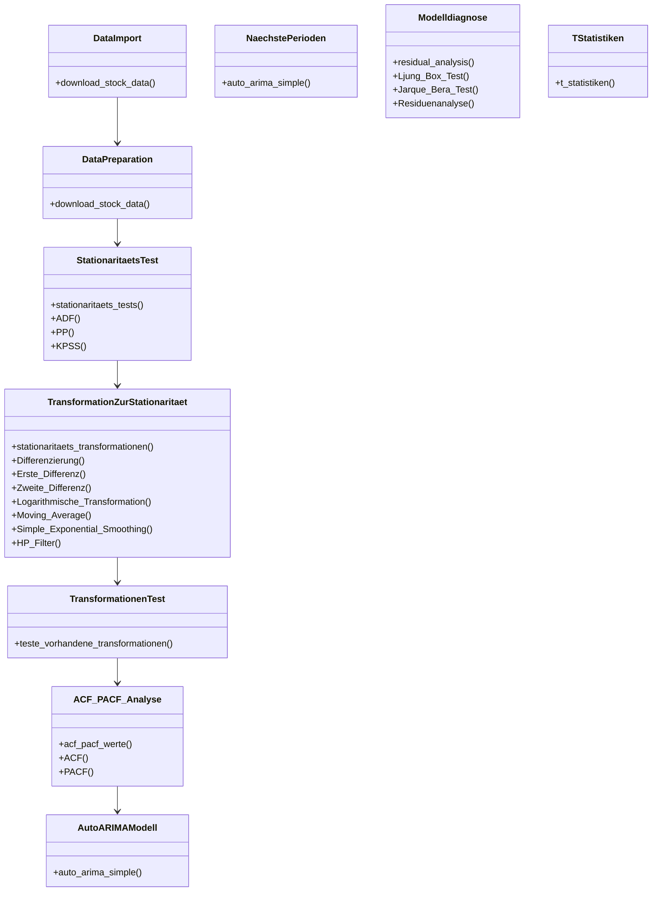

```mermaid
classDiagram

%% === Namespace: overall_preparation.ipynb ===
class DataImport {
    +download_stock_data()
}

class DataPreparation {
    +download_stock_data()
}

DataImport --> DataPreparation

%% === Namespace: overall_analysis.ipynb ===
class StationaritaetsTest {
    +stationaritaets_tests()
    +ADF()
    +PP()
    +KPSS()
}

class TransformationZurStationaritaet {
    +stationaritaets_transformationen()
    +Differenzierung()
    +Erste_Differenz()
    +Zweite_Differenz()
    +Logarithmische_Transformation()
    +Moving_Average()
    +Simple_Exponential_Smoothing()
    +HP_Filter()
}

class TransformationenTest {
    +teste_vorhandene_transformationen()
}

class ACF_PACF_Analyse {
    +acf_pacf_werte()
    +ACF()
    +PACF()
}

class AutoARIMAModell {
    +auto_arima_simple()
}

class NaechstePerioden {
    +auto_arima_simple()
}

class Modelldiagnose {
    +residual_analysis()
    +Ljung_Box_Test()
    +Jarque_Bera_Test()
    +Residuenanalyse()
}

class TStatistiken {
    +t_statistiken()
}

%% === Verbindungen ===
DataPreparation --> StationaritaetsTest
StationaritaetsTest --> TransformationZurStationaritaet
TransformationZurStationaritaet --> TransformationenTest
TransformationenTest --> ACF_PACF_Analyse
ACF_PACF_Analyse --> AutoARIMAModell
AutoARIMAModell
```